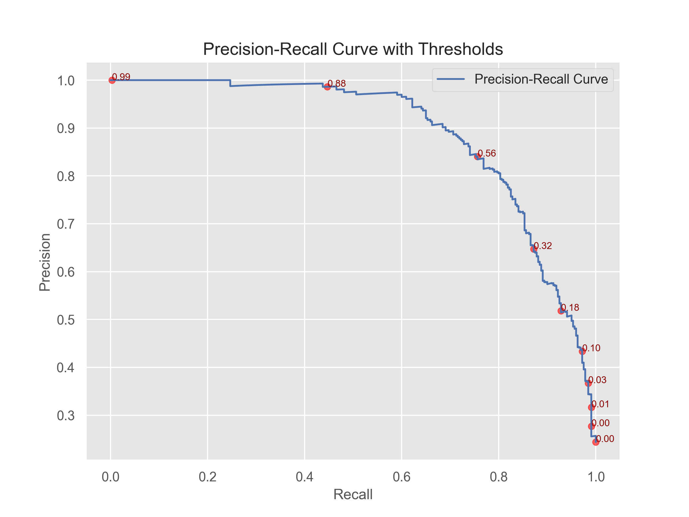
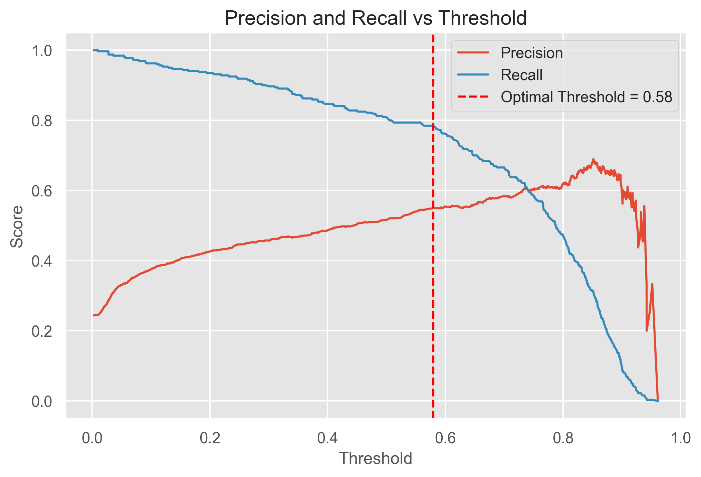

# Stroke Prediction using Machine Learning

  

## Research Question

Can we accurately predict the likelihood of a patient experiencing a stroke based on health and lifestyle factors using machine learning?

---

## Data Sources

The dataset used includes patient demographic and health information such as:

- Age  
- Gender  
- Hypertension  
- Heart disease  
- Smoking status  
- Glucose level  
- BMI  

---

## Techniques Used in the Analysis

### 1. Data Preprocessing and Cleaning

- Handling missing values  
- Encoding categorical variables  
- Feature scaling  

### 2. Exploratory Data Analysis (EDA)

- Identifying trends, correlations, and patterns  

### 3. Feature Selection

- Identifying key predictors of stroke  

### 4. Machine Learning Models

- Logistic Regression  
- Random Forest  
- XGBoost  
- Support Vector Classifier (SVC)  
- Neural Network  

### 5. Model Evaluation Metrics

- Accuracy  
- Precision  
- Recall  
- F1 Score  
- ROC-AUC  
- Precision-Recall Curve  
- Confusion Matrix  

---

## Expected Results

The goal is to build a predictive model that identifies patients at high risk of stroke.  
We also aim to uncover the most influential features in stroke prediction, such as age, hypertension, heart disease, and smoking status.

---

## Why This Question Matters

Stroke is the second leading cause of death globally, accounting for approximately 11% of all deaths (source: World Health Organization).  
Early detection is critical, yet healthcare systems often lack effective, accessible tools to assess stroke risk.  
This project aims to address that gap with a data-driven solution to support timely intervention and improve patient outcomes.

---

## Exploratory Data Analysis (EDA)

  

### Missing Data Percentage

### Target Variable Distribution (Stroke Occurrence)

The dataset is imbalanced, with stroke cases being the minority class.

### Distribution of Numerical Variables

Important numeric features such as age, glucose level, and BMI show varied distributions.

  
  

### Initial Correlation Heatmap (Numeric Features)

Shows relationships between numeric features and stroke incidence.

### Numerical Feature Distributions by Stroke Outcome

Comparison of numeric features between stroke and non-stroke groups.

### Boxplots for Numerical Features by Stroke Outcome

Visualizes spread and outliers for numerical features by stroke status.

### Categorical Feature Stroke Rate Visualization

Stroke rate by categories such as gender, marital status, work type, residence, smoking status, hypertension, and heart disease.

---

## Feature Engineering

- Missing BMI values were imputed using K-Nearest Neighbors to improve model accuracy and recall.  
- Smoking status was mapped to a numeric risk score to quantify its impact.  
- A combined cardiovascular risk feature was created by summing hypertension, heart disease, and smoking risk.  
- BMI was binned into categories like Underweight, Normal, Overweight, and Obese for better model interpretability.

### Final Correlation Heatmap for All Features

Shows the correlations between all features, including engineered variables, and stroke occurrence.

---

### Handling Class Imbalance with SMOTE

Synthetic Minority Over-sampling Technique (SMOTE) is a widely used approach to tackle class imbalance in datasets. In cases where the minority class (such as patients who experienced a stroke) is underrepresented, models tend to be biased towards the majority class, which can result in poor detection of the minority class.

SMOTE addresses this by generating synthetic examples of the minority class. It does so by interpolating between existing minority samples, effectively increasing their number and balancing the dataset.

This balanced dataset enables the machine learning model to better learn the distinguishing features of the minority class, leading to improved performance metrics like recall and F1-score. Using SMOTE is particularly valuable in medical prediction tasks where accurately identifying minority class instances (e.g., stroke cases) is critical.

---

## Model Performance Summary

---

### Logistic Regression

- Accuracy: 75.6%  
- Precision (Class 1): 0.50  
- Recall (Class 1): 0.79  
- F1 Score (Class 1): 0.61  
- Notes: Good recall but low precision.  

  

---

### Logistic Regression with SMOTE

- Accuracy: 76.4%  
- Precision (Class 1): 0.51  
- Recall (Class 1): 0.78  
- F1 Score (Class 1): 0.62  
- Notes: Slight improvement in F1 due to class balance.  

  

---

### Logistic Regression with SMOTE + Threshold Optimization + Hyperparameter Tuning

- Accuracy: 76.7%  
- Precision (Class 1): 0.51  
- Recall (Class 1): 0.79  
- F1 Score (Class 1): 0.62  
- Notes: Most optimized logistic setup with a good balance.  

  

---

### Gradient Boosting with SMOTE

- Accuracy: 79.0%  
- Precision (Class 1): 0.55  
- Recall (Class 1): 0.78  
- F1 Score (Class 1): 0.65  
- Notes: Higher F1 score compared to logistic models.  

  

---

### Gradient Boosting + SMOTE + Hyperparameter Tuning

- Accuracy: 90.5%  
- Precision (Class 1): 0.81  
- Recall (Class 1): 0.80  
- F1 Score (Class 1): 0.80  
- Notes: Best-performing model overall.  

  

---

### Random Forest + SMOTE + Threshold Tuning

- Accuracy: 78.4%  
- Precision (Class 1): 0.54  
- Recall (Class 1): 0.75  
- F1 Score (Class 1): 0.63  
- Notes: Solid baseline performance.  

  

---

### Random Forest + SMOTE + Threshold + Hyperparameter Tuning

- Accuracy: 63.5%  
- Precision (Class 1): 0.40  
- Recall (Class 1): 0.96  
- F1 Score (Class 1): 0.56  
- Notes: Very high recall but poor overall balance.  

  

---

### XGBoost

- Accuracy: 88.7%  
- Precision (Class 1): 0.82  
- Recall (Class 1): 0.69  
- F1 Score (Class 1): 0.75  
- Notes: Strong overall performer, slightly lower recall.  

  

---

### SVC with SMOTE + Hyperparameter Tuning

- Accuracy: 79.2%  
- Precision (Class 1): 0.55  
- Recall (Class 1): 0.78  
- F1 Score (Class 1): 0.65  
- Notes: Comparable to gradient boosting baseline.  

  

---

### Neural Network

- Accuracy: 80.0%  
- Precision (Class 1): 0.58  
- Recall (Class 1): 0.69  
- F1 Score (Class 1): 0.63  
- Notes: Performs well but not the best model.  

  

---

## Conclusion

Based on the evaluation metrics across multiple models, the **Gradient Boosting classifier with SMOTE and hyperparameter tuning** clearly outperforms others, achieving the highest accuracy (90.47%), balanced precision (0.81), recall (0.80), and F1-score (0.80). This indicates it is the most reliable model for predicting stroke risk, effectively handling class imbalance and capturing complex relationships in the data.

While other models like XGBoost and SVC also show strong performance, the tuned Gradient Boosting model provides the best overall balance between sensitivity and specificity, making it the preferred choice for practical deployment in stroke risk prediction.

---

## Future Expansion

- **Model Deployment:**  
  The best-performing model has been saved using joblib for easy reuse. This serialized model can be integrated into a web application or API to enable real-time stroke risk prediction in clinical settings.

- **External Validation:**  
  Test the model on external or newer datasets to verify generalizability and robustness across populations.

- **Feature Expansion:**  
  Incorporate additional clinical variables or patient history data (e.g., medication, family history) to improve prediction accuracy.

- **Explainability & Interpretability:**  
  Use tools like SHAP or LIME to provide interpretable insights for healthcare providers, enhancing trust in the model’s predictions.

- **Monitoring & Maintenance:**  
  Set up pipelines to monitor model performance over time and update it as new data becomes available to avoid performance degradation.

---
